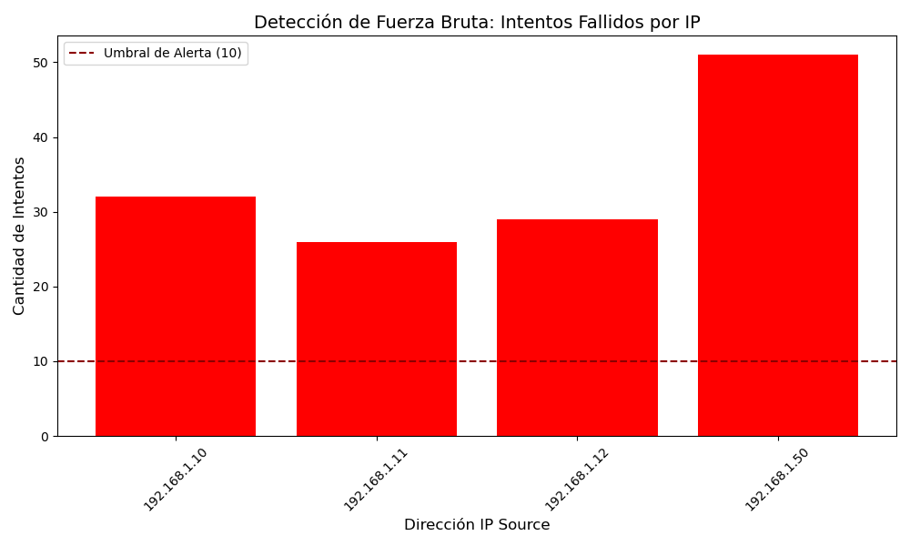

# 🛡️ Purple SIEM Lab: SSH Brute Force Detection

Este proyecto es un laboratorio de **Purple Teaming** diseñado para simular ataques de fuerza bruta y desarrollar capacidades de detección mediante análisis de datos.

## 🚀 Estructura del Proyecto
- `red_generator.py`: Simula actividad de red y ataques dirigidos (Red Team).
- `blue_analyzer.py`: Procesa logs, detecta anomalías y genera alertas visuales (Blue Team).
- `purple_dashboard.py`: Orquestador que ejecuta el flujo completo y genera reportes.

## 📊 Tecnologías Utilizadas
- **Lenguaje:** Python 3.12
- **Librerías:** Pandas, Matplotlib, Tabulate
- **Entorno:** Linux Mint 22.3 (Zena)

## 📈 Resultados
El laboratorio genera automáticamente un análisis de las IPs atacantes y una gráfica de distribución de intentos fallidos para facilitar la respuesta ante incidentes.

